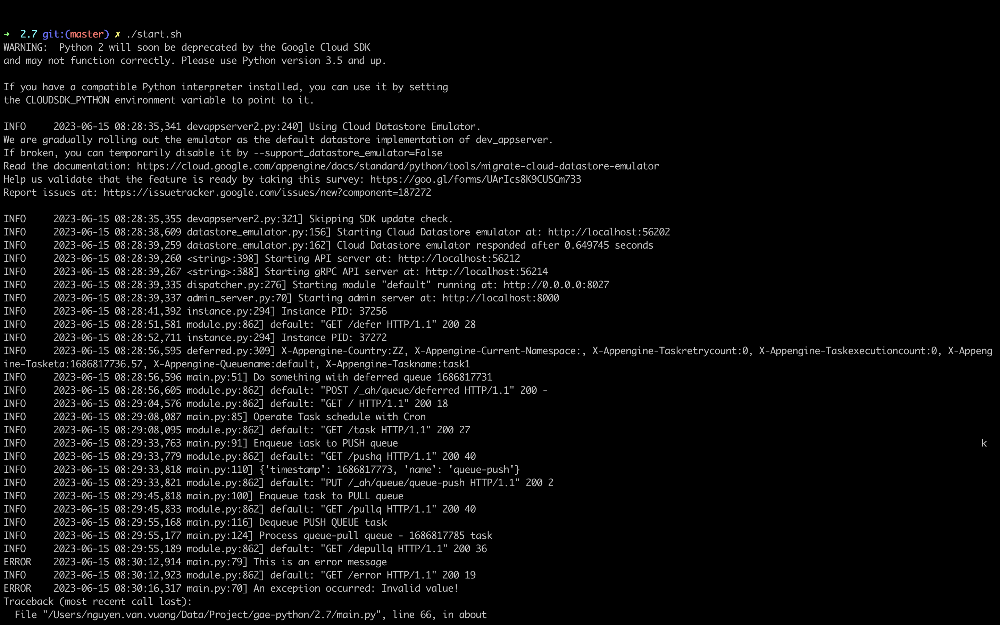
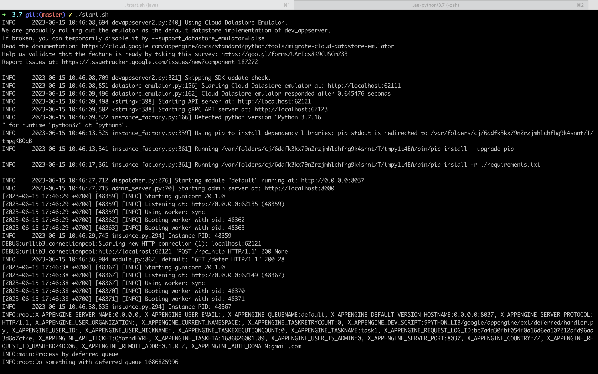

## Guide

Google App Engine (GAE) 1st (aka: legacy runtimes) will be reach End of Support on January 30, 2024. So we need migrate asap our app from Python 2.7 to 3.7+.
The purpose of this project is to determine the key differences when migrating an application running on Google Cloud App Engine 1st (Python 2.7) to Google Cloud App Engine 2nd (Python 3.7).

### Install

**Java JRE**

- For Datastore Emulator
- Download: https://www.oracle.com/java/technologies/downloads/

**Getting Pyenv**

- MacOS

  ```bash
  brew update
  brew install pyenv
  eval "$(pyenv init -)"
  ```

- Ubuntu Linux

  ```bash
  curl https://pyenv.run | bash
  ```

**Install Python 2.7.18 & 3.7.16**

- Install additional Python versions

  ```bash
  pyenv install 2.7.18
  pyenv install 3.7.16
  ```

**Installing the latest gcloud CLI version (435.0.0)**

- Document: https://cloud.google.com/sdk/docs/install-sdk

- [For Ubuntu](https://cloud.google.com/sdk/docs/install-sdk#deb)

- [For MacOS](https://cloud.google.com/sdk/docs/install-sdk#mac)
  - I'm using Google Cloud SDK 426.0.0 (For M1 Mac) Because it's the last version that supports both python 2 and 3
  - For downgrade to this version using below command

    ```bash
    gcloud components update --version 426.0.0
    ```

- If you face the error `Please verify that the following is the path to a working Python 2.7 or 3.5+ executable`, fix it by

  ```bash
  which python
    /Users/nguyen.van.vuong/.pyenv/shims/python
  export CLOUDSDK_PYTHON=/Users/nguyen.van.vuong/.pyenv/shims/python
  ```

- Install additional components: GAE Python

  ```bash
  gcloud components install app-engine-python app-engine-python-extras cloud-datastore-emulator
  ```

- Authorize Gcloud Account

  ```bash
  gcloud auth login
  ```

### Switch between Python 2.7 & 3.7 versions

- **Python 2.7.18**

  - Install dependencies

    ```bash
    cd 2.7
    eval "$(pyenv init -)"
    pyenv local 2.7.18
    pip install virtualenv
    pip install -t lib -r requirements.txt
    ```

  - Start dev server

    ```bash
    chmod a+x ./start.sh
    ./start.sh
    ```

    

  - Access

    - Web: http://localhost:8027

    - Admin: http://localhost:8000

    - Error report: http://localhost:8027/_ereporter?sender=youremail@example.com&date=2023-06-14

  - Deploy to GCP
    - Need enable Cloud Tasks API

    ```bash
    chmod a+x ./deploy.sh
    ./deploy.sh
    ```

- **Python 3.7.16**

  - Install dependencies

    ```bash
    cd 3.7
    eval "$(pyenv init -)"
    pyenv local 3.7.16
    pip install virtualenv
    pip install -r requirements.txt
    ```

  - Start dev server

    ```bash
    chmod a+x ./start.sh
    ./start.sh
    ```

    

  - Access

    - Web: http://localhost:8037

    - Admin: http://localhost:8000

  - Deploy to GCP
    - Need enable Cloud Tasks API

    ```bash
    chmod a+x ./deploy.sh
    ./deploy.sh
    ```

    - If [pressing enter produces ^M instead of a newline](https://askubuntu.com/questions/441744/pressing-enter-produces-m-instead-of-a-newline), try execute command `stty sane`

### Workaround

- "UnicodeDecodeError" when using deferred.defer

  ```bash
  ERROR    2023-06-15 08:07:39,229 module.py:1008] Request to u'/_ah/queue/deferred' failed
  INFO     2023-06-15 08:07:39,230 module.py:890] default: "POST /_ah/queue/deferred HTTP/1.1" 500 -
  WARNING  2023-06-15 08:07:39,231 taskqueue_stub.py:2168] Task task8 failed to execute. The task has no remaining retries. Failing permanently after 0 retries and 0 seconds
  ```

  - The exception is only visible when `--dev_appserver_log_level=debug` is passed into `dev_appserver.py`.
  - This is probably due to the method `put_headers_in_environ` at `.../google-cloud-sdk/platform/google_appengine/google/appengine/tools/devappserver2/util.py:115` coercing str types to Unicode. (For get `SDK Installation Root` using `$ gcloud info`)
  - Replace code

    ```python
    environ['HTTP_%s' % six.ensure_text(key.upper()).replace('-', '_')] = value
    # By use ensure_str instead
    environ[six.ensure_str('HTTP_%s' % key.upper().replace('-', '_'))] = value
    ```
